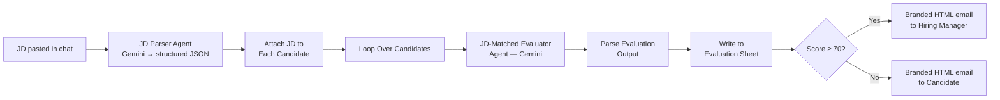
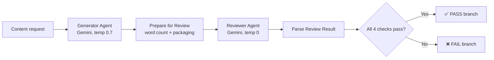
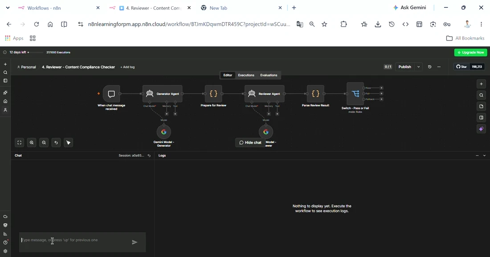

<div align="center">

# 🔗 Serial Agentic Workflows — n8n

### Two multi-step AI pipelines where each stage depends on the last: a hiring evaluator and a generate-then-review compliance checker


**[⬇️ JD Evaluator Workflow](assets/jd-driven-candidate-evaluator.json) · [⬇️ Compliance Checker Workflow](assets/content-compliance-checker.json)**

</div>

---

## TL;DR

Two workflows built around the same underlying pattern — **Serial**: each step runs one after another, using the previous step's output, because order genuinely matters. One evaluates job candidates against a JD end-to-end (parse → score → route → notify); the other is a quality-control loop where a second agent checks the first agent's work before anything ships (generate → review → pass/fail). Different use cases, same architectural principle: some problems can't be solved with one prompt, and the interesting design work is in how the steps hand off to each other.

**My role:** hands-on builder — designed the scoring methodology, the compliance rule set, the node-by-node data contracts, and tested both workflows end to end with real inputs.

---

## 📖 Table of Contents

- [Why "Serial"](#-why-serial)
- [Build 1 — JD-Driven Candidate Evaluator](#-build-1--jd-driven-candidate-evaluator)
- [Build 2 — Content Compliance Checker](#-build-2--content-compliance-checker)
- [Design Decisions That Mattered](#-design-decisions-that-mattered)
- [What This Demonstrates](#-what-this-demonstrates)

---

## 🔍 Why "Serial"

Not every AI workflow benefits from more agents talking to each other in parallel — some problems are genuinely a pipeline, where step 2 is meaningless without step 1's exact output. That's the Serial pattern: best for multi-step processes where order matters and each step depends on the last, as opposed to patterns where independent agents work in parallel or a router dispatches to one specialist. Both builds below commit to that constraint on purpose rather than reaching for a more complex multi-agent setup where a simple pipeline does the job.

---

## 🧑‍💼 Build 1 — JD-Driven Candidate Evaluator

A hiring pipeline: paste a Job Description into chat, and the system parses it into structured requirements, evaluates every candidate in a Google Sheet against that specific JD, writes scored results back to a second sheet, and automatically emails the hiring manager or the candidate depending on the outcome.



**The scoring isn't fixed — the JD Parser decides the weighting per role.** Rather than every role being scored against the same four generic categories, the JD Parser Agent reads the JD and outputs its own `evaluation_weights` (technical skills, experience relevance, leadership fitment, education fitment) that sum to 100 — so a JD emphasizing leadership gets weighted differently than one emphasizing raw technical depth, automatically:

```json
"evaluation_weights": {
  "technical_skills_match": 40,
  "experience_relevance": 30,
  "leadership_fitment": 15,
  "education_fitment": 15
}
```

Each candidate is then scored *only relative to that specific JD* — the Evaluator Agent's own instruction is explicit that "a candidate with irrelevant skills for this specific role should score low even if they are generally talented." Beyond the overall score, the evaluator produces a real gap analysis per candidate: matched vs. missing must-have skills, a CTC/experience fit read, and — the detail I'd call out first in an interview — **auto-generated, gap-specific interview questions** for whoever picks up the shortlisted candidate.

**Real prompt — JD Parser Agent** (trimmed to the structural core):

```text
You are an expert HR analyst and talent acquisition specialist.

Extract and return ONLY a valid JSON object with these fields:
{
  "role_title", "seniority_level", "department",
  "must_have_skills": [...], "good_to_have_skills": [...],
  "min_experience_years", "max_experience_years",
  "evaluation_weights": {
    "technical_skills_match", "experience_relevance",
    "leadership_fitment", "education_fitment"
  },
  ...
}
Make sure evaluation_weights sum to 100.
Return ONLY the JSON. No explanation.
```

**Real prompt — JD-Matched Evaluator Agent** (trimmed):

```text
You are a senior HR evaluator. Evaluate this candidate STRICTLY
against the provided Job Description requirements.

=== EVALUATION TASK ===
Score this candidate ONLY relative to the JD above. A candidate with
irrelevant skills for this specific role should score low even if
they are generally talented.

Return ONLY a valid JSON object:
{
  "overall_score", "technical_skills_score", "experience_score",
  "leadership_score", "education_score",
  "skills_matched": [...], "skills_missing": [...],
  "strengths", "weaknesses", "ctc_fit", "experience_fit",
  "recommendation",
  "interview_questions": [<targeted question based on THIS candidate's gaps>]
}
```

**See it in action** — a real JD run against sample candidates, sheet writing, and email dispatch:

<p align="center">

</p>

<p align="center"><sub><a href="assets/jd-evaluator-demo-full.mp4">▶️ Full-length version (jd-evaluator-demo-full.mp4)</a></sub></p>

---

## 🛡 Build 2 — Content Compliance Checker

A quality-control loop: a Generator Agent writes customer-facing content from a request, and a separate Reviewer Agent checks that output against four compliance rules before it's allowed to pass. Fail any rule, and the workflow routes to a `FAIL` branch instead of shipping the content.



**The 4 compliance rules**, checked independently and reported individually — not collapsed into one opaque verdict:

| Check | Rule |
|---|---|
| **No PII** | No real names, phone numbers, emails, or account numbers — placeholders like `[Customer Name]` are fine |
| **Professional Tone** | Polite, professional, free of slang or profanity |
| **Length Limit** | Under 200 words |
| **No Unsubstantiated Claims** | No absolute guarantees like "100% guaranteed" or "never fails" |

**Different temperatures, on purpose:** the Generator runs at `0.7` so it writes natural, varied content; the Reviewer runs at `0` so it applies the same strict logic every time. You don't want a compliance checker being "creative" about which rules apply — consistency is the entire point of that node.

**Real prompt — Generator Agent:**

```text
You are a CONTENT GENERATOR agent.

Write content based on this request: "{{ $json.chatInput }}"

Guidelines:
- Write professional, clear content suitable for a customer-facing
  or public audience
- Do not include any personal identifiable information (PII) such as
  real names, phone numbers, email addresses, or account numbers —
  use placeholders like [Customer Name] if needed
- Keep the tone professional and on-brand

Output only the generated content, no extra commentary.
```

**Real prompt — Reviewer Agent** — note the output format is locked down to an exact template, not free-form commentary:

```text
You are a REVIEWER agent. Your job is to check generated content
against a compliance checklist and decide PASS or FAIL.

Check the content against EACH of these rules: [the 4 rules above]

Respond in EXACTLY this format, nothing else:
Check 1 - No PII: <Pass/Fail> - <one short reason>
Check 2 - Professional Tone: <Pass/Fail> - <one short reason>
Check 3 - Length Limit: <Pass/Fail> - <one short reason>
Check 4 - No Unsubstantiated Claims: <Pass/Fail> - <one short reason>
Overall Result: <PASS/FAIL>
Summary: <one sentence, and if FAIL, what needs to change>
```

System message reinforces the business rule at the framing level, not just in the task instructions: *"Overall Result is PASS only if ALL 4 checks pass; if ANY check fails, Overall Result is FAIL."* Locking the reviewer to an exact, line-by-line output template — rather than "give me your assessment" — is what makes the downstream `Parse Review Result` code node able to regex-extract each check reliably instead of needing another AI call just to interpret the first one.

**See it in action** — a real content request, generated copy, and a live per-check compliance verdict:

<p align="center">

</p>

<p align="center"><sub><a href="assets/compliance-reviewer-demo-full.mp4">▶️ Full-length version (compliance-reviewer-demo-full.mp4)</a></sub></p>

---

## 🎯 Design Decisions That Mattered

- **Auditability over a black-box verdict** — both workflows write out *why*, not just pass/fail. The evaluator writes all four sub-scores plus matched/missing skills and reasoning; the reviewer reports each of the 4 checks individually. A hiring manager or content owner can see the actual reasoning, not just trust a single number.
- **Weights that adapt to the JD, not a fixed rubric** — the evaluator doesn't apply the same generic scoring formula to every role. The JD Parser Agent itself decides how much technical skill vs. experience vs. leadership vs. education should matter *for this specific role*, so a leadership-heavy JD and a technical-depth-heavy JD get genuinely different evaluation criteria without anyone touching a prompt.
- **Temperature as a deliberate design lever, not a default** — `0` for anything that needs to be strict and repeatable (evaluation scoring, compliance checking), higher for anything that should sound natural (content generation, JD parsing prose). Getting this backwards — a creative compliance checker, or a robotic content generator — breaks the workflow's actual purpose.
- **Graceful degradation when the model doesn't cooperate** — both workflows' code nodes wrap the AI's JSON output in a `try/catch`: if Gemini returns malformed JSON, the workflow doesn't crash — it falls back to a safe neutral default (e.g., all scores at 50, `"Manual review required"` as the recommendation) and keeps moving. The same graceful-fallback discipline I used with a full 3-tier provider fallback in my [Morning Digest](https://github.com/Rehansheikh787/Daily-Morning-Digest-news) and [RupeeRadar](https://github.com/Rehansheikh787/Rupee-Radar-) projects, applied here at the parsing layer instead.
- **Locking output format, not just requesting structure** — the Reviewer Agent's prompt specifies an exact line-by-line response template (not just "respond in JSON"), which is what lets a plain regex in the next node extract each check reliably without a second AI call just to interpret the first one.
- **Schema discipline matters even in no-code tools** — both workflows depend on exact column-name and field-name matching between nodes (a typo in a sheet header silently breaks writes; a Switch node keys off an exact JSON field name). No-code doesn't mean no data contract — it just makes the contract easier to break silently if you're not careful about it.
- **A FAIL branch is a first-class output, not an afterthought** — the compliance checker's `FAIL` path is explicitly designed to route to a rewrite-or-human-review step in a real system, rather than the workflow just stopping. Same principle behind the "below 70" path in the evaluator: the unhappy path gets a defined next action, not silence.

---

## 🎓 What This Demonstrates

- **Recognizing when a pipeline beats a fancier multi-agent setup** — both builds are deliberately Serial because the problem genuinely is sequential, not because it's the only pattern I know
- **Designing for auditability** — scored, reasoned outputs that a human can trust and override, not opaque AI verdicts
- **Treating model parameters as product decisions** — temperature, thresholds, and rule sets are all exposed as tunable, business-owned values rather than hidden inside prompts
- **Planning the unhappy path with the same care as the happy path** — a FAIL or below-threshold outcome is a designed branch with a next action, not a dead end

---

<div align="center">

I'm a **Chemical Engineer transitioning into AI Product Management**, and I build hands-on with agentic workflow tools to understand the real design tradeoffs behind multi-step AI systems.

📂 More case studies and projects on my [GitHub profile](https://github.com/Rehansheikh787).

</div>
